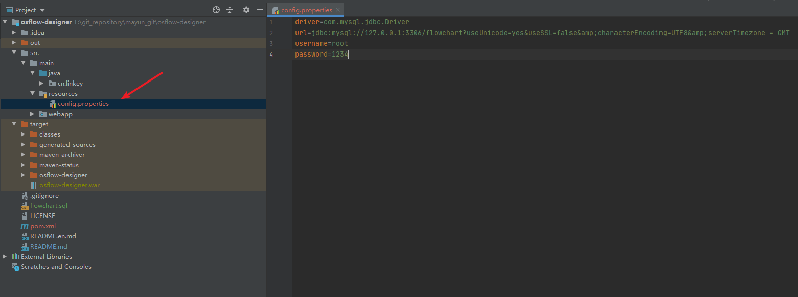
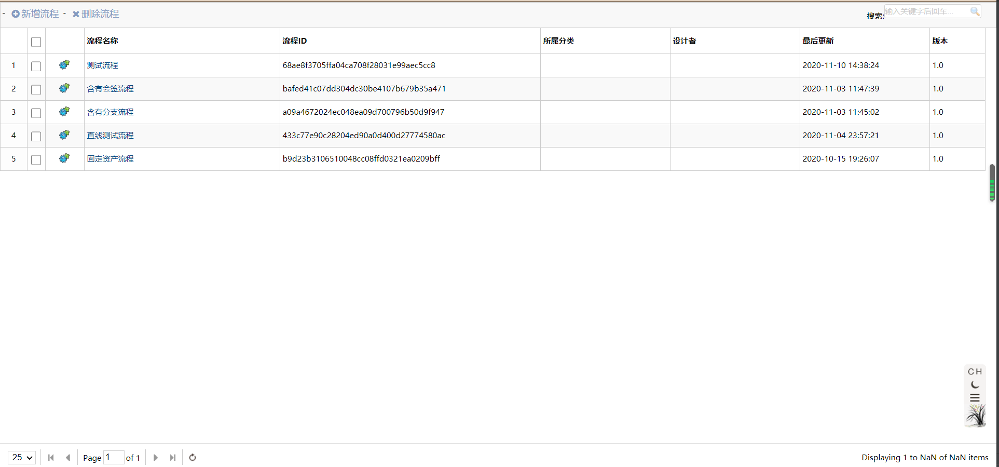
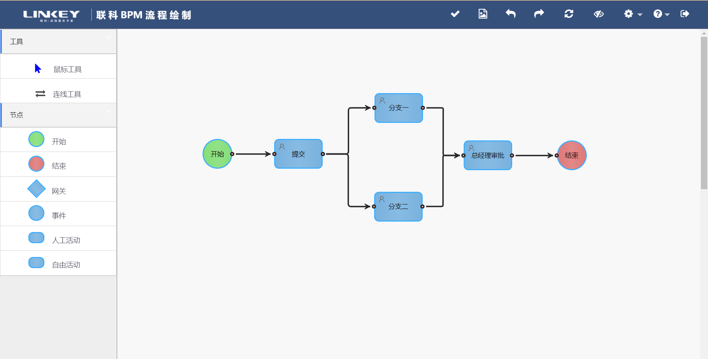

# osflow-designer

#### 介绍
流程图引擎，是流程定义工具，含后台表数据结构版本。

是流程设计器([FlowDesigner](https://gitee.com/openEA/FlowDesigner))的升级版本，与[osflow-engine](https://gitee.com/openEA/osflow-engine)组成完整的流程引擎。


#### 源码部署

1、导入flowchart.sql文件到MySQL数据库中，导入方法：

```shell
#创建数据库flowchart
 CREATE DATABASE flowchart DEFAULT CHARSET utf8 COLLATE utf8_general_ci;
#还原数据库
 mysql -u root -p flowchart < E:\flowchart.sql
```

2、项目依赖于联科的“lkengine-db-1.0.jar”存储引擎，可将maven仓库(联科)文件夹中的"cn"文件夹复制到Maven仓库根目录，或自行关联依赖，后续会上传到中央仓库。

3、用IDEA导入osflow-designer项目，使用Maven构建依赖，并在config.properties文件中配置数据库信息。



4、运行成功效果

1. 流程首页

   

2. 流程定义页面

​       

#### 使用说明

流程定义参考：https://gitee.com/openEA/FlowDesigner


QQ交流群：823545910

